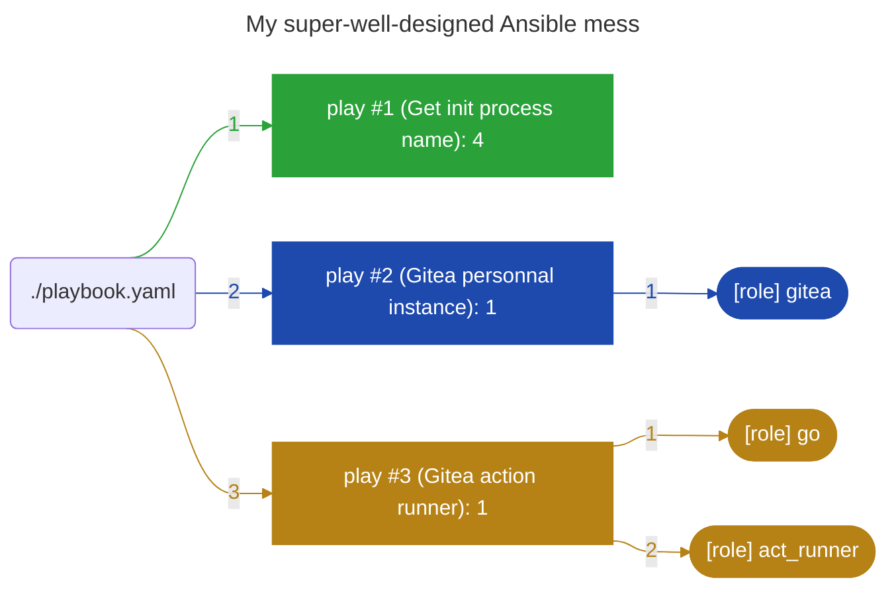

<h2 align="left">Hi 👋! My name is Arthur and I'm a DevOps, from France</h2>

###

  
  

###

###

  
  
  
  
  
  
  
  
  
  
  
  
  
  
  
  

###

  
  
  

###

 

###

```mermaid
---
title: "My super-well-designed Ansible mess"
---
%%{ init: { "flowchart": { "curve": "bumpX" } } }%%
flowchart LR
	%% Start of the playbook './playbook.yaml'
	playbook_f0f51659("./playbook.yaml")
		%% Start of the play 'play #1 (Get init process name): 4'
		play_4bcc3439["play #1 (Get init process name): 4"]
		style play_4bcc3439 stroke:#2aa239,fill:#2aa239,color:#ffffff
		playbook_f0f51659 --> |"1"| play_4bcc3439
		linkStyle 0 stroke:#2aa239,color:#2aa239
		%% End of the play 'play #1 (Get init process name): 4'
		%% Start of the play 'play #2 (Gitea personnal instance): 1'
		play_39d04371["play #2 (Gitea personnal instance): 1"]
		style play_39d04371 stroke:#1e4aae,fill:#1e4aae,color:#ffffff
		playbook_f0f51659 --> |"2"| play_39d04371
		linkStyle 1 stroke:#1e4aae,color:#1e4aae
			%% Start of the role '[role] gitea'
			play_39d04371 --> |"1 "| role_aca34670
			linkStyle 2 stroke:#1e4aae,color:#1e4aae
			role_aca34670(["[role] gitea"])
			style role_aca34670 fill:#1e4aae,color:#ffffff,stroke:#1e4aae
			%% End of the role '[role] gitea'
		%% End of the play 'play #2 (Gitea personnal instance): 1'
		%% Start of the play 'play #3 (Gitea action runner): 1'
		play_ad7c5155["play #3 (Gitea action runner): 1"]
		style play_ad7c5155 stroke:#b68216,fill:#b68216,color:#ffffff
		playbook_f0f51659 --> |"3"| play_ad7c5155
		linkStyle 3 stroke:#b68216,color:#b68216
			%% Start of the role '[role] go'
			play_ad7c5155 --> |"1 "| role_5ad4b113
			linkStyle 4 stroke:#b68216,color:#b68216
			role_5ad4b113(["[role] go"])
			style role_5ad4b113 fill:#b68216,color:#ffffff,stroke:#b68216
			%% End of the role '[role] go'
			%% Start of the role '[role] act_runner'
			play_ad7c5155 --> |"2 "| role_98009d2b
			linkStyle 5 stroke:#b68216,color:#b68216
			role_98009d2b(["[role] act_runner"])
			style role_98009d2b fill:#b68216,color:#ffffff,stroke:#b68216
			%% End of the role '[role] act_runner'
		%% End of the play 'play #3 (Gitea action runner): 1'
	%% End of the playbook './playbook.yaml'

```
