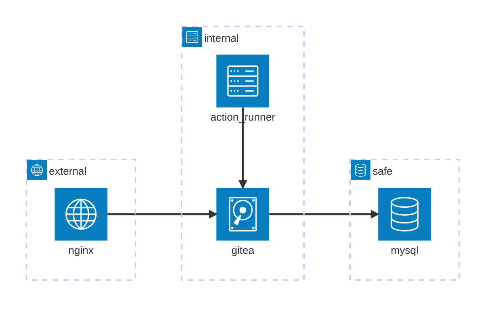
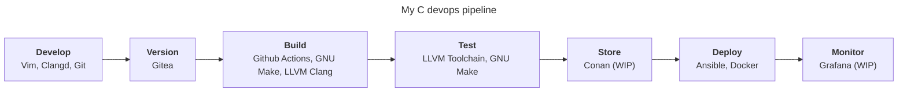

## Hi 👋! My name is Arthur and I'm a student

<h2> I am currently deploying my own tools to improve my C codebase </h2>

 

###

<h3> This architecture will help me achieve the following workflow </h3>

<h3> And here is a graph of my ansible configuration </h3>

